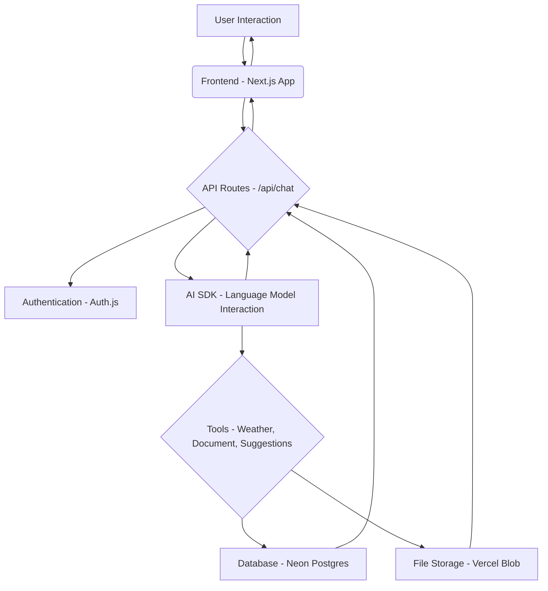

<a href="https://chat.vercel.ai/">
  <p align="center">
    
  </p>
</a>

<p align="center">
  The.com is an innovative, open-source chatbot template designed to empower developers with a robust foundation for building intelligent conversational AI applications. Built with cutting-edge Next.js and the versatile AI SDK, it offers a seamless and efficient development experience.
</p>

<p align="center">
  <a href="https://chat-sdk.dev"><strong>Documentation</strong></a> ·
  <a href="#key-features"><strong>Key Features</strong></a> ·
  <a href="#architecture-flow"><strong>Architecture Flow</strong></a> ·
  <a href="#model-integration"><strong>Model Integration</strong></a> ·
  <a href="#getting-started"><strong>Getting Started</strong></a>
</p>

## Key Features

-   **Next.js App Router**: Leverage advanced routing, React Server Components (RSCs), and Server Actions for unparalleled performance and a smooth user experience.
-   **AI SDK Integration**: A unified API for generating text, structured data, and tool calls with various Large Language Models (LLMs), providing dynamic chat and generative UI capabilities.
-   **Modern UI/UX**: Styled with `shadcn/ui` and `Tailwind CSS`, ensuring a beautiful, responsive, and accessible interface.
-   **Robust Data Persistence**: Utilizes Neon Serverless Postgres for secure chat history and user data management, complemented by Vercel Blob for efficient file storage.
-   **Secure Authentication**: Implements `Auth.js` for simple, secure, and flexible user authentication.

## Architecture Flow



**Flow Description:**

1.  **User Interaction**: Users interact with the chatbot through the Next.js frontend.
2.  **Frontend Processing**: The frontend handles UI rendering and user input, sending requests to the backend API routes.
3.  **API Routes (`/api/chat`)**: These routes process incoming requests, manage chat sessions, and interact with various services.
4.  **Authentication**: `Auth.js` secures user sessions and authorizes access to features.
5.  **AI SDK & Language Model**: The core AI logic, powered by the AI SDK, communicates with the selected language model (e.g., xAI Grok).
6.  **Tool Utilization**: The language model can invoke various tools (e.g., `getWeather`, `createDocument`, `requestSuggestions`) to perform specific actions.
7.  **Database Interaction**: Tools and API routes interact with Neon Postgres for persistent storage of chat history, user data, and other application-specific information.
8.  **File Storage**: Vercel Blob is used for efficient storage and retrieval of files, such as attachments.
9.  **Response Generation**: The AI SDK generates responses, which are then sent back through the API routes to the frontend.
10. **Display to User**: The frontend displays the AI-generated responses to the user.

## Model Integration

This template defaults to `xAI grok-2-1212`. The AI SDK allows seamless switching to other providers like OpenAI, Anthropic, and Cohere with minimal code changes.

## Getting Started

To run The.com locally, follow these steps:

1.  **Environment Setup**: Ensure you have the environment variables defined in `.env.example`. It's recommended to use Vercel Environment Variables for production, but a local `.env` file works for development.

    > **Security Note**: Do not commit your `.env` file to version control, as it contains sensitive API keys and secrets.

2.  **Install Vercel CLI**:
    ```bash
    npm i -g vercel
    ```

3.  **Link Project**: Link your local instance with your Vercel and GitHub accounts:
    ```bash
    vercel link
    ```

4.  **Download Environment Variables**:
    ```bash
    vercel env pull
    ```

5.  **Install Dependencies & Run Development Server**:
    ```bash
    pnpm install
    pnpm dev
    ```

Your chatbot application will now be accessible at [http://localhost:3000](http://localhost:3000).

---

**The.com** - _Intelligent Conversations, Simplified Development._
