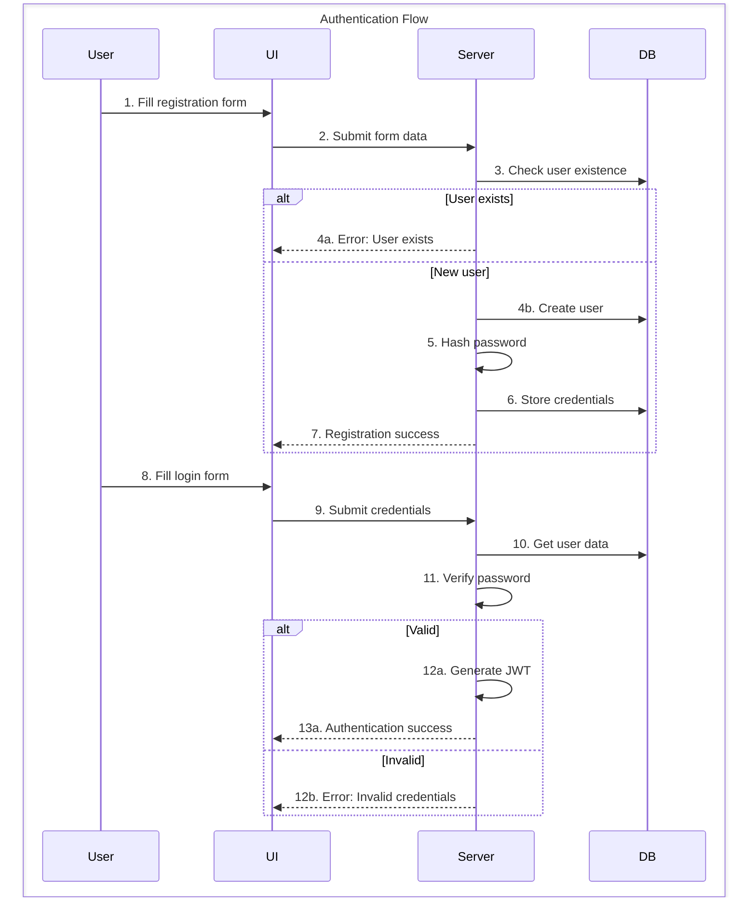

```mermaid
sequenceDiagram
    box Authentication Flow
        participant User
        participant UI
        participant Server
        participant DB
    end

    User->>UI: 1. Fill registration form
    UI->>Server: 2. Submit form data
    Server->>DB: 3. Check user existence
    alt User exists
        Server-->>UI: 4a. Error: User exists
    else New user
        Server->>DB: 4b. Create user
        Server->>Server: 5. Hash password
        Server->>DB: 6. Store credentials
        Server-->>UI: 7. Registration success
    end

    User->>UI: 8. Fill login form
    UI->>Server: 9. Submit credentials
    Server->>DB: 10. Get user data
    Server->>Server: 11. Verify password
    alt Valid
        Server->>Server: 12a. Generate JWT
        Server-->>UI: 13a. Authentication success
    else Invalid
        Server-->>UI: 12b. Error: Invalid credentials
    end
```